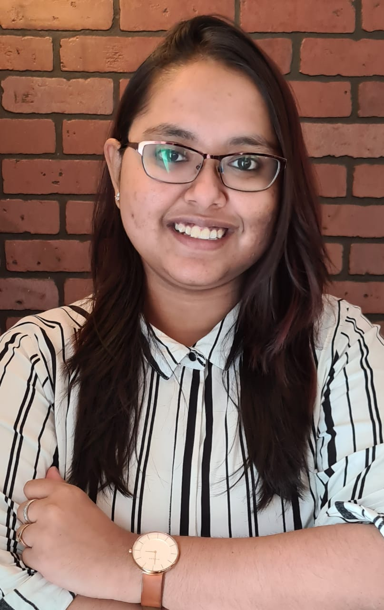

# Hi there👋 , I am Srishti

  ## Connect with Me 🤝🏻

  
  
  
    <!--  -->
  <!--  -->
 
  
  
:girl: Pronouns - She/Her/Hers
  
###  More about me:
  
I am an **Electrical Engineering**:mortar_board: by Degree . I am into Problem Solving and also a Robotics Enthusiast. I also have my hands on technologies like <b>Python</b>, <b>MatLab</b>,<b>Machine Learning</b> and <b>Deep Learning<b/>.Industry professional with 3+ Years experience, worked as a **Production Planner in GE Power Manufacturing** unit with a proven track record of managing skills. I like challenging roles and responsibilities with innovative bent of approach and technology.Feel free to reach out to me on LinkedIn (active there)!
  
### :1st_place_medal: Some of my acheivements:

* **Top 8 national finalists for the event Go Green In the city 2018 organized by Schneider Electric**
* Best paper award :- Awarded the best paper reward for the event Luminesce 2017 organised by ISLE.
* Secured 1st place in College's Final Year Project.

 
 
⚡ I’m currently a **Master's Student**:mortar_board: at <a href = "https://www.ncsu.edu/" target="_blank"><b>North California State University</b></a>.  
💬 Ask me about <b>Python, ML, Electrical, and DL .</b> 
   <a href = "" target="_blank"><b>RESUME</b></a>.
  
  
 ### :page_with_curl: **Publication**
  **Global shift towards a low carbon energy future with proper space managementGlobal shift towards a low carbon energy future with proper space management
  ISLE proceedings · Apr 1, 2017**
  
  Other authors :woman_teacher:  
  Sakshi Singh :woman: 
  Twinkle Jaiswal :woman:
  

  
 ### :page_facing_up: Course & Certifications:  
 
* Digital Manufacturing & Design Technology Specialization
* <a href = "https://www.coursera.org/account/accomplishments/certificate/UUQUH4PUY5WZ" target="_blank"><b>Advanced Manufacturing Enterprise</b></a>. 
* <a href = "https://www.coursera.org/account/accomplishments/certificate/FQGW6JW5WXLU" target="_blank"><b>Intelligent Machining</b></a>. 
* <a href = "https://www.coursera.org/account/accomplishments/certificate/RHP94LTFWAMW" target="_blank"><b>Cyber Security in Manufacturing</b></a>. 
*  <a href = "https://www.coursera.org/account/accomplishments/specialization/certificate/9JUAV9KRE5Q7" target="_blank"><b>Digital Manufacturing & Design Technology</b></a>. 
* <a href = "https://www.coursera.org/account/accomplishments/certificate/NH32GXR8EJTV" target="_blank"><b>Advanced Manufacturing Process Analysis</b></a>. 
* <a href = "https://www.coursera.org/account/accomplishments/certificate/5DESAM6MRW6L" target="_blank"><b>Digital Thread: Implementation
</b></a>. 
 
 ### Hobbies:  
 :musical_note: Music 
 :writing_hand: Writing 
 :woman_singer: Singing 
 
  
#### :woman_technologist: Languages and Tools:  
<code></code>
<code></code>
<code></code>
<code></code>
<code></code>
<code></code>
<code></code>
<code></code>

  
  &nbsp; &nbsp; &nbsp; &nbsp; &nbsp; &nbsp; &nbsp; &nbsp; &nbsp; &nbsp; 
  
  
  
  

 If you find my work good, consider giving it a ⭐ to show some ❤️!
